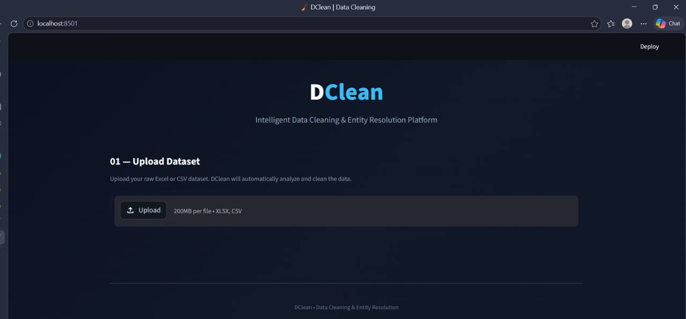
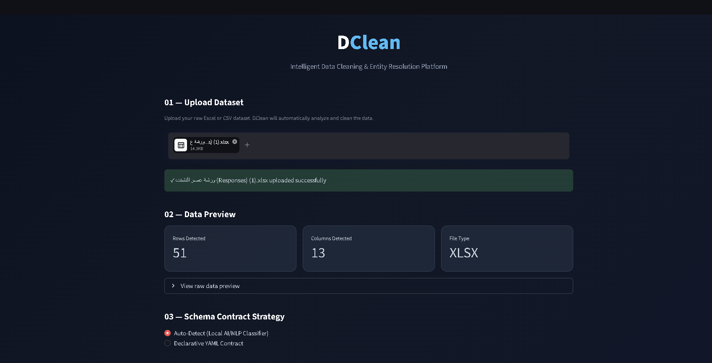
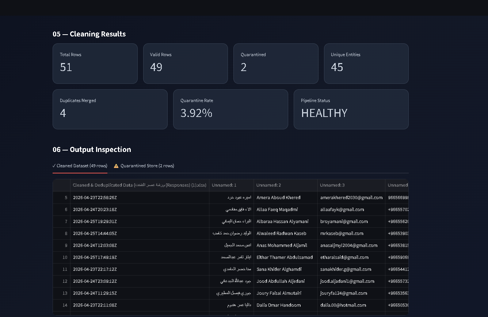

# DClean — Data Cleaning & Entity Resolution Platform

> Intelligent Data Cleaning, Standardization, and Entity Resolution for Arabic and English datasets.

## 📌 Overview

DClean is an intelligent, offline data-cleaning platform designed to process messy Excel and CSV datasets.

The system automatically cleans and standardizes data, validates records, detects duplicate submissions, resolves entities, and produces structured outputs for analysis and auditing.

## ✨ Key Features

- 🇸🇦 Saudi phone number normalization
- 🌐 Arabic and English name standardization
- 📧 Email typo correction and normalization
- 🎓 University and academic-level normalization
- 👥 Entity Resolution and duplicate detection
- 🛡️ Quarantine handling for invalid or incomplete records
- 🗄️ SQLite relational data storage
- 📊 Automated audit and quality metrics
- 📁 Formatted Excel output
- 💻 Interactive Streamlit dashboard
- 🔒 Local and offline processing

---

# 🖥️ Dashboard

DClean provides an interactive Streamlit dashboard that guides the user through the complete data-cleaning pipeline.

## 1. Upload Dataset

The user starts by uploading an Excel or CSV dataset.

The dashboard immediately detects the file type, number of rows, and number of columns, and provides a raw-data preview.



---

## 2. Schema Contract Strategy

DClean supports two approaches for understanding the input dataset:

- **Auto-Detect** — automatically detects the meaning of input columns.
- **Declarative YAML Contract** — uses a predefined schema for known dataset structures.

This allows the system to work with datasets that may have different column names and structures.

---

## 3. Cleaning Results

After processing the dataset, the dashboard displays the main pipeline metrics.

### Example Result

| Metric | Result |
|---|---:|
| Total Rows | 51 |
| Valid Rows | 49 |
| Quarantined Rows | 2 |
| Unique Entities | 45 |
| Duplicates Merged | 4 |
| Quarantine Rate | 3.92% |
| Pipeline Status | **HEALTHY** |



### What the results mean

- **Total Rows:** Number of records processed.
- **Valid Rows:** Records that successfully passed the cleaning and validation pipeline.
- **Quarantined Rows:** Records isolated because they could not safely pass validation or entity resolution requirements.
- **Unique Entities:** Number of distinct people identified after Entity Resolution.
- **Duplicates Merged:** Duplicate submissions that were linked to existing entities.
- **Quarantine Rate:** Percentage of records placed in quarantine.
- **Pipeline Status:** Overall status of the processing pipeline.

---

## 4. Output Inspection

The dashboard allows users to inspect the generated cleaned dataset and quarantined records directly.



The cleaned output contains standardized and deduplicated records, while quarantined records are kept separately for review and auditing.

---

# 🔗 Entity Resolution

Entity Resolution is responsible for determining whether different records belong to the same real-world person.

For example:

```text
Record A
Name: Hashim Almaramhi
Phone: 0501234567

Record B
Name: Hashim Almaram
Phone: 0501234567

The system first uses deterministic identifiers such as normalized phone numbers and emails.

When deterministic matching is not sufficient, the system uses Jaro-Winkler similarity to compare names.

Similarity Threshold

The current resolver uses a threshold of:

0.88

Meaning:

Similarity >= 0.88  → Match
Similarity <  0.88  → Different Entity

Once records are resolved to the same person, they share the same internal person_id.

🗄️ Data Storage

DClean stores the processed data in both Excel and SQLite formats.

Excel Output

The generated workbook contains sheets such as:

Cleaned_Data
quarantine_records
audit_summary
dim_persons
SQLite Database

The relational database contains:

dim_persons

Stores unique resolved individuals.

person_id
name
phone
email
fact_registrations

Stores registration or event records linked to the corresponding person.

The relationship is maintained using a Foreign Key:

dim_persons.person_id
        ↑
        |
Foreign Key
        |
fact_registrations.person_id
quarantine_records

Stores records that could not safely pass validation or resolution.

audit_runs

Stores pipeline execution metrics and quality information.

🔄 Processing Pipeline
Raw Dataset
     ↓
Schema Detection / Contract
     ↓
Data Normalization
     ↓
Validation
     ↓
Entity Resolution
     ↓
Duplicate Handling
     ↓
Quarantine
     ↓
Excel + SQLite Storage
     ↓
Audit Results
🧪 Example

For the demonstrated dataset:

Input Records       : 51
Valid Records       : 49
Quarantined         : 2
Unique Entities     : 45
Duplicates Merged   : 4
Quarantine Rate     : 3.92%
Pipeline Status     : HEALTHY
👨‍💻 My Contribution
Hashim — Entity Resolution & Data Storage

My main contribution focused on:

Implementing Entity Resolution logic
Implementing Jaro-Winkler similarity matching
Handling duplicate submissions
Linking registration records to resolved entities
Implementing SQLite data storage
Maintaining Primary Key / Foreign Key relationships
Enforcing SQLite foreign-key integrity
Writing and validating tests for the pipeline
🛠️ Technologies
Python
Pandas
SQLite
OpenPyXL
Streamlit
scikit-learn
Jaro-Winkler Similarity
YAML
Git & GitHub
▶️ Run the Dashboard
py -m streamlit run dashboard.py

The application runs locally and processes uploaded datasets on the user's machine.

📁 Project Purpose

DClean was developed to make messy registration and survey datasets easier to clean, standardize, deduplicate, inspect, and store in a structured format.

The project combines:

Data Cleaning + Standardization + Entity Resolution + Relational Storage + Auditing
